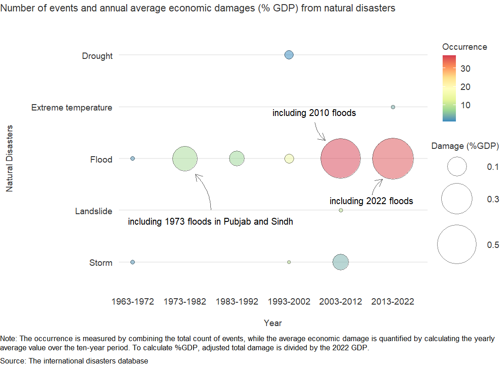
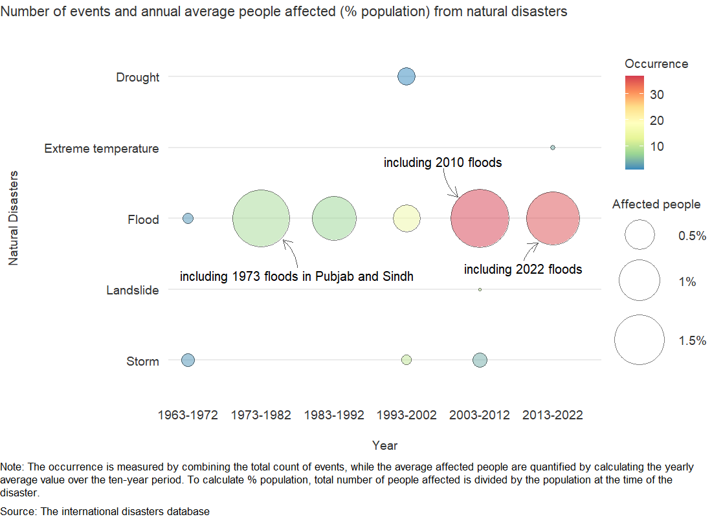
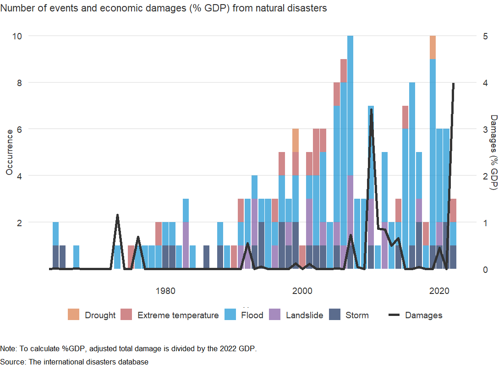
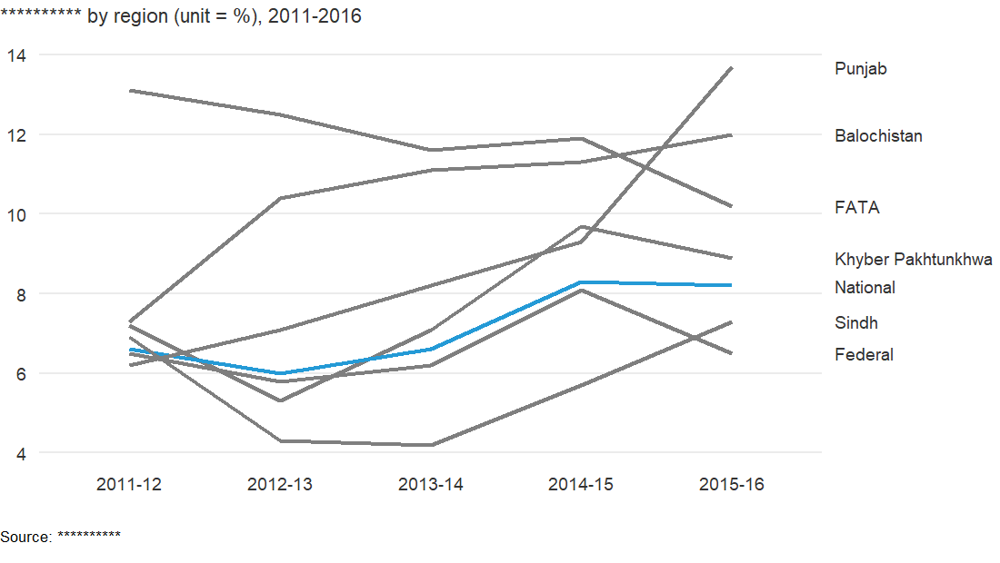

Pakistan Disasters
================
07/26/2023

     

## Chart A - Number of events and annual average economic damages (% GDP) from natural disasters

     

## Chart B - Number of events and annual average people affected (% population) from natural disasters

     

## Chart C - Number of events and economic damages (% GDP) from natural disasters

     

## Chart D - \*\*\*\*\*\*\*\*\*\*

